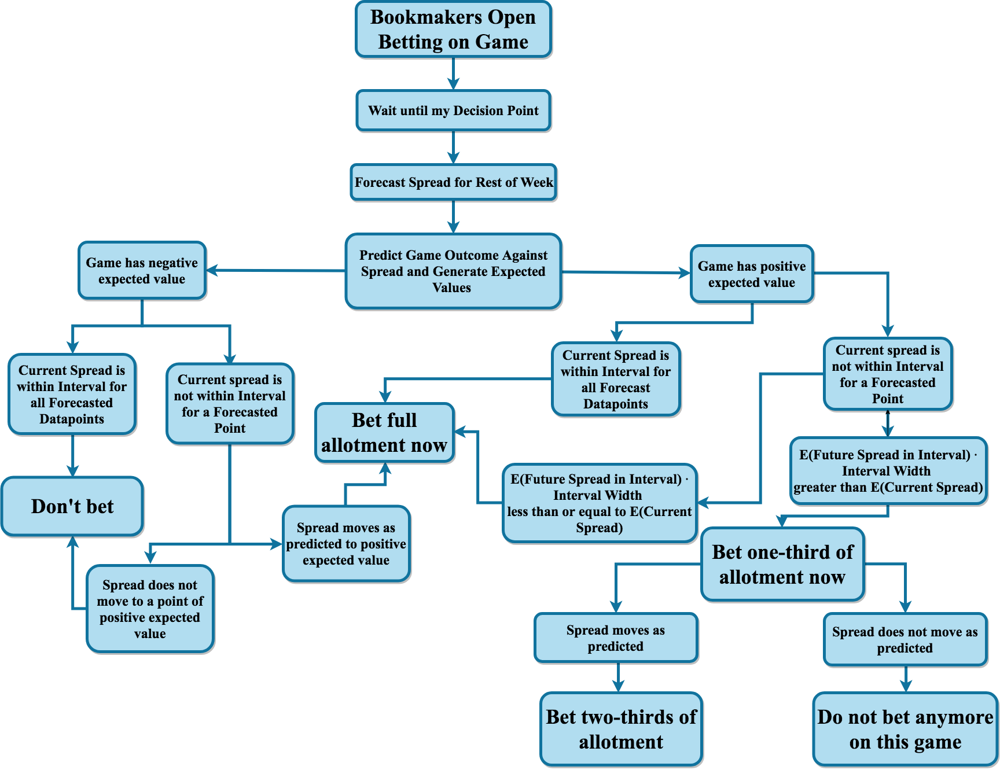

```{r, set.seed(1234), include = FALSE}
knitr::opts_chunk$set(cache = T, warning = FALSE, message = FALSE, echo = FALSE, fig.cap = " ")
```

```{r, include = FALSE}
library(lattice)
library(readxl)
library(dlm)
library(MASS)
library(tidyverse)
library(lme4)
library(merTools)
library(forecast)
library(plyr)
library(ggpubr)
library(stargazer)
library(rvest)
library(kableExtra)
library(reshape2)
library(ggplot2)
library(extrafont)
```

```{r, include = FALSE}
load("my_work_space.RData")
```

#Modeling {#model}

I have two separate aspects to modeling: forecasting the point spread throughout the week and predicting the score of the game.  For both processes, I tried different approaches to modeling and chose the best performing model based on performance on test datasets.

##Point Spread Forecasting Model

I forecasted the point spread throughout the week by treating this object as a time-series.  I explored the data with an aim to find the best approach to modeling, before then moving into the modeling procedure.  The best performing model was a time-varying Bayesian Dynamic Linear Regression model that used ARIMA (Autoregressive Integrated Moving Average) methods to forecast the time-varying parameters that are used to forecast the point spread in the Dynamic Linear Regression Model.  In addition, for utilizing the model, I needed to determine how many data points will be in the series.  I used a mixed linear regression model for this purpose.  

###Exploratory Data Analysis
```{r histPsSd, warnings = FALSE, echo = FALSE, fig.cap = "Histograms of Point Spreads and Score Differences from Games"}
more_stat2$result_v_spread <- as.numeric(more_stat2$spread) - (more_stat2$home_score - more_stat2$away_score)

gg_spread <- ggplot(data = more_stat2, aes(as.numeric(spread))) + geom_histogram(binwidth = .5) + labs(x = "Spread") 

gg_score_diff <- ggplot(data = more_stat2, aes(as.numeric(score_diff_away))) + geom_histogram(binwidth = 1) + labs(x = "Score Difference From Game") 

ggarrange(gg_spread, gg_score_diff)
```

The first aspect to examine when forecasting the spreads is the distribution of spreads.  It is also important to look at the distribution of game outcomes that these spreads model.  Figure \@ref(fig:histPsSd) shows both of these distributions.  Both have multiple peaks.  These multiple peaks arise because in football, nearly all scores are worth $3$ or $7$ points.  When predicting the difference between two teams, many games will end up with a forecasted spread near these key numbers, and the results of these games will fall at these numbers often.  In addition, there are a few dead zones -- mainly in between $0$ and $3$.  The results of the games mirror the distribution of the forecast spreads, however, with a much wider distribution.  It is difficult to forecast a blowout game, but they do occur, which is why there are much longer tails for the true score differences.  

```{r histGRSP, fig.cap = "Histogram of Game Results against Spread"}
ggplot(data = more_stat2, aes(as.numeric(result_v_spread))) + geom_histogram(binwidth = 1) + labs(x = "Spread of Game - Score Difference from Game") 
```

Figure \@ref(fig:histGRSP) shows a distribution of the result of the game against the spread.  A result of $0$ would indicate that the game ended with the same result as the spread, and the result of the game would be a push, meaning that nobody wins and the bettor's stake is returned to the better.  To demonstrate the accuracy of the bookmaker's, it is evident that the distribution is relatively normally distributed around $0$, with a second peak at $-3$ indicating that many of the games resulted in the home team beating the spread by $3$ points.    

```{r trans, echo = FALSE, fig.cap = "Transformations of Key Betting-Statistic Variables"}
p1 <- ggplot(data = more_stat2, aes(away_cash_bet)) + geom_histogram(bins = 50) + labs(x = "Away Cash Bet") 
p2 <- ggplot(data = more_stat2, aes(log(away_cash_bet))) + geom_histogram(bins = 50) + labs(x = "log(Away Cash Bet)") 

p3 <- ggplot(data = more_stat2, aes(away_ticket_num)) + geom_histogram(bins = 50) + labs(x = "Away Number of Bets") 
p4 <- ggplot(data = more_stat2, aes(log(away_ticket_num))) + geom_histogram(bins = 50) + labs(x = "log(Away Number of Bets)") 

ggarrange(p1, p2, p3, p4)
```

Research^[https://www.thesportsgeek.com/sports-betting/strategy/point-spread/] suggests that casinos adjust the line based on the amount of cash bet on each side, so that they can even out the amount of money bet on each time and guarantee themselves a return.  Examining the cash variables can help evaluate this research.  Figure \@ref(fig:trans) demonstrates the skewness of the cash and ticket number variables, as well as updated distributions after transformations.  The cash variable is very right-skewed.  For modeling and interpretability, it is integral to transform this variable into the log of the cash bet.  The number of bets on each side  is also right skewed.  The $\log(\text{Away Cash Bet})$ and $\log(\text{Away Number of Bets})$ are both significantly closer to normally distributed.  
 


```{r lineDiff, echo  = FALSE, fig.cap = "Line Difference versus Key Variables"}

more_stat2$line_diff <- more_stat2$away_line_open - more_stat2$away_line_close
p5 <- ggplot(data = more_stat2, aes(y=line_diff, x = away_cash_percent)) + geom_smooth(method = "lm") + geom_jitter() + labs(y = "Inital Spread - Closing Spread", x = "Away Cash Percentage")

p6 <- ggplot(data = more_stat2, aes(y=line_diff, x = log(away_cash_bet))) + geom_smooth(method = "lm") + geom_jitter() + labs(y = "Inital Spread - Closing Spread", x = "Log(Away Cash Bet)")

ggarrange(p5, p6)

```

Figure \@ref(fig:lineDiff) shows the the line difference from when the casino first listed the spread to the spread when the game started compared with the cash percentage and the $\log(\text{Away Cash Bet})$.  Research^[https://www.thesportsgeek.com/sports-betting/strategy/point-spread/] suggests that with more cash bet on the away team, the casino would want to make the spread less favorable for the away team, in an effort to get more money placed on the home team and achieve a 50/50 split.

Here, while the effect is not major, for both the away cash percentage and away cash amount variables, as they increase, the line difference for the away tends to become more negative.  This means that when more cash is on the away team, the spread tends to become more favorable to the home team.  For example, a line difference of -2 means that the initial spread could have been the away team is favored by 6 points (-6), but then the spread moved to make the away team favored by 8 points (-8).  The away team must now win by more than 8 points to cover the spread, opposed to the previous point where the away team only needed to win by more than 6 points.  

There are a few outliers where the line difference is greater than 5 points.  This sort of extreme movement only can occur due to big player news.  For example, if there is news on the Friday leading up to the game that Tom Brady is injured and cannot play, this would cause a massive swing in the line that would not be related to the cash and ticket percentages.  


###Modeling the Point Spread


```{r, include = FALSE}
#Starting values from prior:

j<-125
example_df <- eval(parse(text = paste0("df_", list_of_games[j], "_Week",
                                       nfl_scores2018$Week[j], "_",
                                       nfl_scores2018$Year[j])))

example_df <- example_df[-1,]

forecast_ex_df <- eval(parse(text = paste0("forecast_", list_of_games[j], "_Week",
                                       nfl_scores2018$Week[j], "_",
                                       nfl_scores2018$Year[j])))

example_df$spread <- as.numeric(example_df$spread)
h <- round(nrow(example_df) / 3)
ex_filter_df <- example_df[1:(nrow(example_df) - h),]

true_final_spreads <- as.numeric(example_df$spread[(nrow(example_df) - h + 1):nrow(example_df)])


ex_newspread <- c(rep(NA, h))


ex_newlogawaycash <- forecast(auto.arima(ex_filter_df$log_away_cash_bet, seasonal = FALSE), h = h)$mean
ex_newloghomecash <- forecast(auto.arima(ex_filter_df$log_home_cash_bet, seasonal = FALSE), h = h)$mean
ex_newlogawaytic <- forecast(auto.arima(ex_filter_df$log_away_tic_num, seasonal = FALSE), h = h)$mean
ex_newloghometic <- forecast(auto.arima(ex_filter_df$log_home_tic_num, seasonal = FALSE), h = h)$mean

ex_newawaycashpercent <- exp(ex_newlogawaycash) / (exp(ex_newlogawaycash) + exp(ex_newloghomecash))
ex_newawayticpercent <- exp(ex_newlogawaytic) / (exp(ex_newlogawaytic) + exp(ex_newloghometic))

ex_newhometic <- exp(ex_newloghometic)
ex_newawaytic <- exp(ex_newlogawaytic)

ex_newhomecash <- exp(ex_newloghomecash)
ex_newawaycash <- exp(ex_newlogawaycash)


ex_newdata <- data.frame(ex_newspread, ex_newlogawaycash, ex_newloghomecash, ex_newlogawaytic, 
                      ex_newloghometic, ex_newawaycashpercent, ex_newawayticpercent, ex_newawaytic, ex_newhometic,
                      ex_newawaycash, ex_newhomecash)
colnames(ex_newdata) <- c("spread", "log_away_cash_bet", "log_home_cash_bet", "log_away_tic_num", "log_home_tic_num",
                       "away_cash_percent", "away_ticket_percent", "away_ticket_num", "home_ticket_num",
                       "away_cash_bet", "home_cash_bet")

ex_filter_df <- rbind.fill(ex_filter_df, ex_newdata)

ex_start.vals = c(var(example_df$spread), 0,0)

ex_xreg_arima = matrix(data = c(ex_filter_df$log_away_cash_bet, ex_filter_df$away_ticket_num,
                             ex_filter_df$log_home_cash_bet, ex_filter_df$home_ticket_num), nrow = nrow(ex_filter_df), ncol = 4)

ex_arima.model <- auto.arima(ex_filter_df$spread, seasonal = FALSE, 
                          xreg = ex_xreg_arima)

ex_newxreg_arima = matrix(data = c(ex_newdata$log_away_cash_bet, ex_newdata$away_ticket_num,
                                ex_newdata$log_home_cash_bet, ex_newdata$home_ticket_num), nrow = nrow(ex_newdata), ncol = 4)

ex_arima_forecasts = forecast(ex_arima.model, xreg = ex_newxreg_arima, h = h)

ex_TVP.mle <- dlmMLE(y=ex_filter_df$spread, parm=ex_start.vals, x.mat = ex_filter_df$log_away_cash_bet +
                    ex_filter_df$away_ticket_num
                  + ex_filter_df$log_home_cash_bet + ex_filter_df$home_ticket_num,
                  build=buildTVP, method="BFGS")

ex_TVP.dlm <- buildTVP(ex_TVP.mle$par, x.mat = ex_filter_df$log_away_cash_bet +
                      ex_filter_df$away_ticket_num
                    + ex_filter_df$log_home_cash_bet + ex_filter_df$home_ticket_num)

ex_TVP.f <- dlmFilter(y = ex_filter_df$spread, mod = ex_TVP.dlm)

v <- sapply((nrow(example_df) - h + 1):nrow(example_df), function(x) (dlmSvd2var(ex_TVP.f$U.R, ex_TVP.f$D.R)[[x]][1]))

low_bound <- ex_TVP.f$f[(nrow(ex_filter_df) - h + 1):nrow(ex_filter_df)] + qnorm(0.10, sd = sqrt(abs(v)))
high_bound <- ex_TVP.f$f[(nrow(ex_filter_df) - h + 1):nrow(ex_filter_df)] + qnorm(0.90, sd = sqrt(abs(v)))

ex_newdata$spread <- ex_TVP.f$f[(nrow(ex_filter_df) - h + 1):nrow(ex_filter_df)]
ex_newdata$rounded_spread <- round(ex_newdata$spread / .5) * .5

ex_newdata$low_bound <- low_bound
ex_newdata$high_bound <- high_bound

ex_newdata$low_bound_round <- round(low_bound / .5) * .5
ex_newdata$high_bound_round <- round(high_bound / .5) * .5

ex_newdata$spread_arima <- ex_arima_forecasts$mean
ex_newdata$rounded_spread_arima <- round(ex_newdata$spread_arima / .5) * .5

ex_newdata$low_bound_arima <- ex_arima_forecasts$lower[,1]
ex_newdata$high_bound_arima <- ex_arima_forecasts$upper[,2]

ex_newdata$low_bound_round_arima <- round(ex_newdata$low_bound_arima / .5) * .5
ex_newdata$high_bound_round_arima <- round(ex_newdata$high_bound_arima / .5) * .5

ex_newdata$low_bound_round <- round(low_bound / .5) * .5
ex_newdata$high_bound_round <- round(high_bound / .5) * .5


```

After exploratory data analysis, the next step is finding the best model to forecast the future spread.  The model needs to forecast what the spread will be from a certain decision point.  This first decision point is the first point when bets will be placed.  The chosen decision point is after two-thirds of the observations in each time-series.  The data frame containing the observations for each game is cut off at the two-thirds mark, and the model then forecasts the point spread for the final one-third of observations, using only the information up to this two-thirds point.  I consider a Bayesian and frequentist approach to modeling the point spread.  After forecasting the point spread for the final one-third observations, I calculate the error for each model by finding the difference between the forecasted point spread and true point spread for each observation.  I use the forecasts from the model with the lowest average error across all my time-series’ in my betting strategies. 

The Bayesian approach to modeling is a time-series random walk plus noise regression model.  The process starts by placing a prior for the parameters in my model before updating these parameters with the posterior mean through finding the MLE of the parameters of this regression model.  The regressors in the model are the $\log(\text{Away Cash Bet})$, Away Number of Bets (Away Ticket Number), $\log(\text{Home Cash Bet})$ and Home Number of Bets (Home Ticket Number).  

The full process of creating the dynamic linear model is demonstrated through the example of the Week 2, 2018 game between the Minnesota Vikings and the Green Bay Packers.


Equations \@ref(eq:basicDLM) and \@ref(eq:basicDLM2) express a dynamic linear regression model with time-varying parameters.

\begin{eqnarray}
  y_{t} =& \textbf{X}_{t}^{'} \ \theta_{t} + v_{t} \hspace{.5cm} v_{t} \sim& N(0, V_{t}) \text{; (observation equation)} (\#eq:basicDLM) \\ 
  \theta_{t} =& G_{t} \ \theta_{t-1} + \omega_{t} \hspace{.5cm} \omega_{t} \sim& N(0, W_{t}) \text{; (evolution equation).} (\#eq:basicDLM2)
  \end{eqnarray}

The vector of observations up to time $t$ is $y^{t} = (y_1, ..., y_t)$.  The observation equation (Equation \@ref(basicDLM)) describes the vector of observations $y_{t}$ (the spread at time $t$) through its State vector $\theta_{t}$ (the predictor variables at time $t$) and the vector of noise from the observations $v_t$.  The evolution equation (Equation \@ref(basicDLM2)) describes the evolution of the state vector over time with a Markov structure.  $\theta_{t}$ is the state vector of the time-varying regression parameters (of number $p$); $\theta_{t} = (\alpha_{t} \ ; \beta_{t})^{'}$ with dimension $p \times 1$. $\alpha_{t}$ and $\beta_{t}$ are the regression coefficients  $\textbf{X}_{t}^{'}$ is the row vector of covariates at time t of dimension $1 \times p$.  $w_t$ is the variance of the state-space vectors.  $G_{t}$ is an evolution matrix of $p \times p$ dimension.  This is the evolution matrix because it allows for the evolution of the state space vector by matching up the dimensions the parameters.  $G_{t}$ is typically, and in this model, an identity matrix.

This is the general setup for a dynamic linear regression model.  Equations \@ref(eq:gendlm1) --- \@ref(eq:gendlm3) show the expansion of equation \@ref(eq:basicDLM).

\begin{eqnarray}
  y_{t} = \alpha_{t} + \beta_{t} \ \textbf{X}^{'}_{t} + v_{t} \hspace{1cm} v_{t} &\sim& N(0, V_t) (\#eq:gendlm1) \\
  \alpha_{t} = \alpha_{t-1} + \epsilon_{t}^{\alpha} \hspace{1cm} \epsilon_{t}^{\alpha} &\sim& N(0, \sigma^{2}_{\alpha}) (\#eq:gendlm2) \\
  \beta_{t} = \beta_{t-1} + \epsilon_{t}^{\beta} \hspace{1cm} \epsilon_{t}^{\beta} &\sim& N(0, \sigma^{2}_{\beta}) (\#eq:gendlm3)
  \end{eqnarray}

There are three parameters that need to be set, and that is the variance of the observations $V_t$, and then the variances of the regression coefficients for the state-space vector -- $\sigma^{2}_{\alpha}$ and $\sigma^{2}_{\beta}$.

This can be done through a Bayesian method, where the initial parameter start values are set, and then through finding the MLE of the DLM using the *dlmMLE*, these parameters are updated with the posterior mean.  I used sample observational variance of the spread up to the first decision point as the starting value of the observational variance $V$.  I used a flat prior for the variances of the regression parameters have a flat prior.  Table \@ref(tab:ppvalue) shows the values for the prior and posterior means of the variance parameters.

```{r ppvalue, results = "markup"}
se2 <- sqrt(exp(ex_TVP.mle$par))

pre_post <- data.frame(cbind(ex_start.vals, se2))
rownames(pre_post) <- c("$V$", "$\\sigma^{2}_{\\alpha}$", "$\\sigma^{2}_{\\beta}$")

kable(pre_post, col.names = c("Prior Parameters", "Posterior Parameters"),
      booktabs = T, caption = "Prior and Posterior Values for Variance 
      Parameters", row.names = T, escape = F)
```

The posterior mean for the $\sigma^{2}_{\alpha}$ and $\sigma^{2}_{\beta}$ values are used diagonally in the $\omega_t$ matrix.  Looking back at equations \@ref(eq:basicDLM) and \@ref(eq:basicDLM2), $\theta_t$ for each observation is found through using $\alpha_t$ and $\beta_t$ values, which are drawn through $\sigma^{2}_{\alpha}$ and $\sigma^{2}_{\beta}$.  The values of the design vector $\textbf{X}^{'}_{t}$ comes directly from the predictors and the variance for $V$ is set.  Thus, all the parameters needed for modeling are set, and I use a dynamic linear regression model through the function *dlmModReg* to calculate my values for the observational values ($y_t$) and the state-space parameters ($\theta_t$).  This is done through the filtering method.  

The filtering distribution takes in the DLM, and returns a series of one-step forecasts for the observations.  These one-step forecasts are created from filtering all the information up to time $t$. The first step of the filtering distribution has a starting value $\theta_0 \sim N(m_0, C_0)$.  $m_0$ and $C_0$ are the pre-sample means and variances for $\theta$.

1. $\theta_0 \sim N(m_0, C_0)$.
2. One-step forecast for the state:
    \begin{equation}
      \theta_t \mid y^{t-1} \sim N(a_t, R_t)
      \end{equation}
    for $a_t = G_t \cdot m_{t-1}$ and $R_t = G_t \cdot C_{t-1} \cdot G_{t}^{'} + W_t$.
    
3. One-step forecast for the observation:
    \begin{equation}
      y_t \mid y^{t-1} \sim N(f_t, Q_t)
      \end{equation}
    for $f_t = F_t \cdot a_t$ and $Q_t = F_t \cdot R_{t-1} \cdot F_{t}^{'} + V_t$.
    
Creating a filtered distribution with the *dlmFilter* function returns a series of one-step forecasts and variances for the observations, as well as the same information for the state-space vector.  

For a time-invariant dynamic linear model, there would be no extra work for finding a forecast for the observations after a given point $t$.  But, for a time-varying model, such as this, the $\textbf{X}^{'}_{t}$ values are also unknown past the given point $t$.  The Kalman filtering method extends the time-series with new future predictor values, but does not input future values for the observational values.  Once the future predictor values are entered, I create a filtered distribution with this new set -- using the filtered values of the extended observational values as my forecast.

There are a few common methods for finding new methods for the predictor values, such as inputting the last known observation, the mean or the median.  However, since my predictor values continue to grow, these methods do not apply to this model.  So, at the decision point, I fit ARIMA models for each of my new predictor values. I used the *auto ARIMA* method to generate these new values for each of my predictor variables.  Using the ARIMA method is a frequentist approach to a time-series forecast.  I used this approach because for two reasons: it is unrealistic to build a separate Bayesian DLM for each parameter and these parameters simply grow without fluctuation (unlike the point spread), so it is not as necessary to build as complex of a model.  There are three parameters that go into that ARIMA method: *p* is the number of lag observations in the model, *d* is the degree of differencing and *q* is the order of the moving average.

The *auto.arima* function automatically chooses the best *p, d* and *q* values that will minimize the AIC and BIC of the model.  However, by setting the seasonal parameter to "false", I ensured that no model that incorporated a seasonal trend is chosen because that would not fit these data.  Figure \@ref(fig:tickfore) is the forecasted number of tickets versus the true number of tickets for the Green Bay Packers versus Minnesota Vikings game.  While this forecast is certainly not perfect, it generally follows a similar path to the true value.  This is certainly an imperfect method and one area for improvement in this facet of the model.

```{r tickfore, fig.cap = "Forecasted versus True Away Ticket Number"}
ggplot(data = example_df, aes(y=away_ticket_num, x = 1:nrow(example_df))) + 
  geom_line(aes(color = "True Value")) + geom_vline(xintercept = nrow(ex_newdata) * 2, linetype = "dotted") + 
  geom_line(data = ex_newdata, aes(y=away_ticket_num, x = (nrow(ex_newdata) * 2):nrow(example_df), color = "Auto.Arima Forecast")) + labs(y = "Away Ticket Number", x = "Index")
```

This forecast model for the number of tickets is an ARIMA(1, 2, 2) model that is expressed in Equations \@ref(eq:arima112) and \@ref(eq:arima1122).

\begin{eqnarray}
  \hat{Y_t} =& \hat{y_t} + 2Y_{t-1} - Y_{t-2} (\#eq:arima112) \\
  \hat{y_t} =& \mu + AR1 \cdot y_{t-1} - MA1 \cdot e_{t-1} - MA2 \cdot e_{t-2} (\#eq:arima1122)
\end{eqnarray}

Table \@ref(tab:arimcoef112) displays the coefficients to the ARIMA(1, 2, 2) model.  

```{r arimcoef112}
tic_model_ex <- auto.arima(ex_filter_df$log_away_tic_num, seasonal = FALSE)
tic_model_ex_coef <- tic_model_ex$coef
names(tic_model_ex_coef) <- c("AR1", "MA1", "MA2")
kable(tic_model_ex_coef, col.names = "Coefficient", booktabs = T, caption = "Coefficients of ARIMA(1, 2, 2) Model for Away Ticket Number")
```

```{r diag112, fig.cap = "Diagnostic Plots for ARIMA(1, 2, 2) Model for Away Ticket Number", fig.width = 7, fig.height = 7}
tsdiag(tic_model_ex)
```


Figure \@ref(fig:diag112) is the diagnostic plots for the *auto.arima* method for forecasting the number of tickets for the away team.  The plots show that this model is a pretty good fit for the data, as the standardized residuals generally look like white noise, though the p-values for autocorrelation become significant when the lag factor reaches high values such as 9.  As these models are automatically fitted to best describe the data at hand, they generally fit the data pretty well.  

It is important to note that the automatic ARIMA is fit for each different new variable from each time-series (opposed to using the same ARIMA model for the cash bet for all series) because the trends are not the same across all series.  While bookmakers generally look to obtain 50/50 amount of cash on each game, this is certainly not always the case, as bookmakers will take a position on many of the games.  Thus, the automatic ARIMA model will fit the model best to the data for each of the predictor variables.  

Finally, after generating new values for the predictor variables in my DLM, the Kalman filtering method can be used to find predictions for the spread.  This method follows the exact same approach as above, however, the one-step forecasts for the last third of observations will replace the NAs.  

In addition, for comparison, the spread is also modeled with the *auto.arima* forecast, using the same predictor variables as the Bayesian DLM as regressors.  This is a frequentist approach for modeling each time-series.  The accuracy of each approach is determined by looking at the average error in the predicted spread values versus the true spread values.  

For this example game between the Green Bay Packers and the Minnesota Vikings, the
*auto.arima* method fit an ARIMA(1, 0, 0) model, which is a first-order autoregressive model.

Equation \@ref(eq:arima100) expresses this model.
\begin{equation}
Y_t = c + \phi_{p} Y_{t-1} + \epsilon_t \hspace{.5cm} \epsilon_t \sim N(0, \sigma^{2}_{\epsilon}) (\#eq:arima100)
	\end{equation}

$c$ is the intercept or the constant in the equation and $\phi_{p}$ is the vector of coefficients for the autoregressive term (AR), as well as all the predictors.  Table \@ref(tab:coef100) shows the coefficients of this model and the variance parameter $\sigma_{\epsilon}^{2}$ = $0.00595$.  

```{r coef100}
ex_coef <- ex_arima.model$coef
names(ex_coef) = c("AR1", "Intercept", "Log Away Cash", "Log Home Cash", "Away Ticket Number", "Home Ticket Number")
kable(ex_coef, col.names = "Coeffecient", booktabs = T, caption = "Coeffecients of ARIMA(1, 0, 0) Model for the Point Spread")
```

```{r}
eps_sigma <- ex_arima.model$sigma2
```

```{r spvfore, echo = FALSE, fig.cap = "Spread versus Forecasts for Minnesota Vikings at Green Bay Packers Week 2, 2018"}

fcasts_spread_plot <- ggplot(data = example_df, aes(x = 1:nrow(example_df), y = spread))   + 
  geom_line(data = example_df, aes(x = 1:nrow(example_df), y = spread, color = "True Spread")) +
  geom_line(data=forecast_ex_df, aes(x = (nrow(example_df) * (2/3)):nrow(example_df), y = spread, color = "Bayesian Forecasted Spread" )) + 
  geom_line(data=forecast_ex_df, aes(x = (nrow(example_df) * (2/3)):nrow(example_df), y = spread_arima, color = "Auto Arima Forecasted Spread")) + 
  labs(x = "Index", y = "Away Spread")
fcasts_spread_plot
```

Figure \@ref(fig:spvfore) compares the Bayesian DLM and the frequentist ARIMA model’s predictions with the true final spread values from the game between the Minnesota Vikings and the Green Bay Packers.  The blue line represents the true spread, while the red and green lines represent the Bayesian and frequentist forecasts, respectively.  Both forecasts correctly predict the spread to rise.  However, the Bayesian approach does a better job, in this scenario, of being closer to the true spread values.  

```{r sprvint, fig.cap = "Spread versus Bayesian Forecast for Minnesota Vikings at Green Bay Packers Week 2, 2018 with 80% Confidence Interval"}
h <- round(nrow(example_df) * (1/3))
int_spread_plot <- ggplot(data = example_df, aes(x = 1:nrow(example_df), y = spread))  +  
  geom_ribbon(data = forecast_ex_df, aes(ymin = low_bound, ymax = high_bound, x = (nrow(example_df) - h + 1):nrow(example_df),
                                         color = "80% Interval for Bayesian Forecast"), alpha = 0.3) +
  geom_line(data = example_df, aes(x = 1:nrow(example_df), y = spread, color = "True Spread")) +
  geom_line(data=forecast_ex_df, aes(x = (nrow(example_df) - h + 1):nrow(example_df), y = spread, color = "Bayesian Forecasted Spread" )) + labs(x = "Index", y = "Away Spread")
int_spread_plot

```

Figure \@ref(fig:sprvint) shows the Bayesian DLM forecast with a 80\% confidence interval.  I chose an 80\% confidence based on trial and error.  Here, while the spread at the decision point is within the 80\% interval, there is a point when the spread reaches Vikings (-1) when the spread is out of the 80\% interval.  This will be a key distinction to make when it comes to betting strategies.  Actually, this is why I chose an 80\% confidence, as opposed to a more standard 95\% confidence interval.  With the wider 95\% confidence interval, it is more rare for me to have a value outside of that interval.  Since I make betting decisions based on whether the spread is within the selected interval, I use an interval that allows me to incorporate more instances of waiting to bet until the future spread moves to a more advantageous position.  Also, while 95\% confidence interval is more standard, the choice is as arbitrary as an 80\% confidence interval.  

```{r norqq, echo = FALSE, fig.cap = "Normal QQ Plot for Residuals of the Forecasted Spread from the DLM"}
ex_res <- residuals(ex_TVP.f, sd = FALSE)[1:(nrow(example_df) - h)]
qqnorm(ex_res)
qqline(ex_res)
```

Figure \@ref(fig:norqq) shows the residuals plot from the filtered distribution.  The residuals do not seem to be completely normally distributed.  This is due to the fact that the true spread can only move in increments of 0.5, which is a massive amount in terms of the jumps in the filtered values.  When looking at the rounded values of the spread, however, the residuals are more likely to be normally distributed.

```{r diagdlm, fig.width = 7, fig.height = 7, fig.cap = "Diagnostic Plots for DLM of MIN at GB game"}
tsdiag(ex_TVP.f)
```

Figure \@ref(fig:diagdlm) is the diagnostic plots for the Kalman-filtered model of the Minnesota Vikings at Green Bay Packers game.  The p values for autocorrelation are all extremely high, indicating there is no autocorrelation.  The residuals generally look like noise, with a few exceptions attributed to the nature of these data, and the ACF is within the bounds for all factors of the lag.  

After building two models, I chose to use the forecasts from the best performing model.  For each time-series, the error is the sum of the difference between each true spread and predicted spread.  Each method had a vector of errors of 414 errors.  

When looking at the error vectors, I removed 5 outliers where *each model* had error sums above 100 total points.  It is interesting to note that both models had the same forecasts for some series' -- especially those with the largest errors.  These massive errors that both models found are likely due to games that were affected extraordinary circumstances for which my model cannot account.  I did not use the time-series predictions for these 5 games for my simulations either.  

```{r exclude}
kable(nfl_scores2018[which(abs(error_rate) > 100), c("gameID", "Week", "Year")], caption = "Sum of Error Greater than 100")
```

Table \@ref(tab:exclude) shows the five games that were excluded.  After taking a brief look at these games, it is noteworthy that the PHIvJAC game was played in London at 9:30AM ET (6:30AM PT) on a Sunday.  The odd start time could have caused odd betting patterns where there were way fewer bets in the last third of observations than normal.  Typically the amount of cash increases more linearly.  However, with such an early start time on a Sunday morning, combined with the fact that people often have plans on Saturday nights, there may be a massive influx of money very close to the start of the game, as people wake up just before the game starts -- opposed to having a few hours to place bets before the game starts.  

```{r cashweek, fig.cap = "Total Cash Bet on GB vs. MIN (left) compared to PHI vs. JAC (right) Throughout the Week"}

packers_bet <- ggplot(example_df, aes(x = 1:nrow(example_df), y = (away_cash_bet + home_cash_bet))) + geom_line() + labs(x = "Index", y = "Total Cash Bet on GB vs. MIN") + geom_vline(xintercept = nrow(example_df) * (2/3), linetype = "dotted") 

phi_bet <- ggplot(df_PHIvJAC_Week8_2018, aes(x = 1:nrow(df_PHIvJAC_Week8_2018), y = (away_cash_bet + home_cash_bet))) + geom_line() + labs(x = "Index", y = "Total Cash Bet on PHI vs. JAC") + geom_vline(xintercept = nrow(df_PHIvJAC_Week8_2018) * (2/3), linetype = "dotted") 

ggarrange(packers_bet, phi_bet)

```


Figure \@ref(fig:cashweek) represents the amount of cash bet throughout the week.  The dotted line is the decision point.  The charts show that the odd start time games have a significantly more massive exponential increase in the amount of money bet directly after the decision point.  This makes these games tough to model.  In addition, looking at the GB vs. DET game that was a massive outlier, star Green Bay Packers quarterback Aaron Rodgers was questionable to play throughout the week due to injury.  He was finally announced as healthy late in the week.  It is unclear the circumstances for the other three outliers.


```{r sumerror, echo = FALSE}


bayes_error_sum <- summary(error_rate[which(abs(error_rate) < 100)])
arima_error_sum <- summary(error_rate[which(abs(error_rate2) < 100)])

error_table <- data.frame(rbind(bayes_error_sum, arima_error_sum)) 

row.names(error_table) <- c("DLM Errors", "Auto ARIMA Errors")

kable(error_table, booktabs = T, col.names = c("Min.", "1st Q", "Median", "Mean", "3rd Q", "Max"), 
      caption = "Summary Statistics for Errors") 
```

```{r abserror}

abs_errors <- matrix(c(median(abs(error_rate)), mean(abs(error_rate[which(abs(error_rate) < 100)])), median(abs(error_rate2)), mean(abs(error_rate2[which(abs(error_rate) < 100)]))), nrow=2)

row.names(abs_errors) = c("Median Abs. Error", "Mean Abs. Error")

kable(abs_errors, col.names = c("DLM", "Auto ARIMA"), booktabs = T, caption = "Mean and Median Absolute 
      Error", row.names = T)
```

Table \@ref(tab:sumerror) displays the summary statistics for my two vectors.  these data shows that the DLM model has a lower mean error.  In addition, when looking at simply absolute error, the Bayesian DLM approach provided a lower median absolute average error, as seen in Table \@ref(tab:abserror), so I used this model’s forecasts for incorporating the future values from my decision point.

###Modeling Number of Observations

To predict how many future points to forecast from a certain time $t$, I built a simple linear regression model.  I gathered ten equally spaced data points from each of my data sets.  Each data point contains information on the amount of total cash, total number of tickets and number of observations up to time $t$, as well as the number of final data points in this series.  One row of this data frame is shown in Section \@ref(appen2) of the Appendix.  I then built a simple mixed linear regression model to forecast the number of total data points in the series, so I could find how many points $h$ I should use for forecasting at my decision point.  While I considered using Poisson regression because the number of observations are a number of occurrences, the Poisson mixed linear and simple model did not fit the data as well as the linear mixed model, based on the diagnostics of the model.  Equations \@ref(eq:obsreg) --- \@ref(eq:obsreg3) is the equation for this simple mixed model, with $n_i$ representing the amount of final observations in the series, while $n_t$ is the amount of observations up to time $t$.  Week is a factor and random effect (playoffs are treated here as week 0), as certain weeks attract more bettors than other weeks.    

\begin{eqnarray}
  \notag &\text{for} \ j \ in \ 0 \ , \ . . . \ , \ 17 \\
	&\hat{n_i} = \beta_{0} + \beta_{1} \cdot \log(\text{Total Cash Bet}) + \beta_{2} \cdot \log(\text{Total Tickets}) + \beta_{3} \cdot \text{n}_t + \alpha_j^{\text{week}} + \epsilon_i (\#eq:obsreg) \ \ \  \\
  &\epsilon_i \sim N(0, \sigma^2_{\text{residuals}}) (\#eq:obsreg2) \\
  &\alpha_j^{\text{week}} \sim N(0, \sigma^2_{\text{week}}) (\#eq:obsreg3)
  \end{eqnarray}

The coefficients and diagnostics for this model are also shown in Section \@ref(appen2) of the Appendix, as this is a less essential part of the greater goal of this thesis.

```{r}
samp_nrow_at_time <- c()
samp_nrow_final <- c()
samp_tic_num <- c()
samp_cash_num <- c()
samp_week <- c()

for (i in 1:nrow(nfl_scores2018)){
  col_df <- eval(parse(text = paste0("df_", list_of_games[i], "_Week", nfl_scores2018$Week[i], "_",
                                     nfl_scores2018$Year[i])))
  sam_tot_cash <- col_df$away_cash_bet + col_df$home_cash_bet
  sam_tot_tic <- col_df$away_ticket_num + col_df$home_ticket_num
  samp_nrow_at_time <- append(samp_nrow_at_time, sapply(1:10, function(x) round(nrow(col_df) * x / 10)))
  samp_nrow_final <- append(samp_nrow_final, rep(nrow(col_df), 10))
  samp_tic_num <- append(samp_tic_num, sapply(1:10, function(x) sam_tot_tic[round(nrow(col_df) * x / 10)]))
  samp_cash_num <- append(samp_cash_num, sapply(1:10, function(x) sam_tot_cash[round(nrow(col_df) * x / 10)]))
  samp_week <- append(samp_week, rep(nfl_scores2018$Week[i], 10))
}

samp_nrow_df <- data.frame(samp_nrow_final, samp_nrow_at_time, samp_tic_num, samp_cash_num, samp_week)

nrow.lm <- lmer(data = samp_nrow_df, samp_nrow_final ~ log(samp_tic_num) + log(samp_cash_num) + (1|as.factor(samp_week)) + samp_nrow_at_time)
```

##Game Result Prediction

###Overview of Decisions

```{r flowChart, fig.cap = "Overview of Betting Decisions"}

```

Figure \@ref(fig:flowChart) shows a flow chart detailing the different possible scenarios and how much I would bet in each scenario.  I use “allotment” to describe the betting amount because the many different betting strategies will bet different amounts for the same scenarios.  The bookmakers open up betting on the game by placing an initial spread typically about a week before the game starts.  I then wait until my decision point, forecast the spread for the rest of the week up until game time and provide a probability estimate for each team beating the spread.  If betting on the game provides negative expected value based on the probability point estimate, I do not bet on the game, but I leave the opportunity open to bet later on in the week if a new, forecasted spread would make the advantageous to bet on.  If the game has positive expected value, I place my bet on the game at the decision point.  However, if the future forecasted spread projects a new spread that is even more advantageous to bet on, then I will only place a portion of my bet at the decision point and wait to place the rest of my bet.  If the spread does in fact move as projected, I then place the rest of the bet the moment the spread hits my projections.

###Exploratory Data Analysis


```{r grspd, echo = FALSE, fig.cap = "Game Result Against Spread vs. Spread -- The red indicates that the team has beat the spread and the black indicates that the team has failed to beat the spread"}

p10 <- ggplot(data = more_stat2, aes(y=result_v_spread, x = as.numeric(spread))) + geom_smooth(method = "lm") + geom_jitter(color = more_stat2$away_team_cover + 1) + labs(y = "Score Differential - Spread", x = "Spread") 

p9 <- ggplot(data = more_stat2, aes(y=result_v_spread, x = away_WEI.dvoa)) + geom_smooth(method = "loess") + geom_jitter(color = more_stat2$away_team_cover + 1) + labs(y = "Score Differential - Spread", x = "Weighted DVOA")

p10
```

Some key decisions determine whether the actual spread itself was a major factor in predicting team performance against the spread.  In Figure \@ref(fig:grspd), the y variable is the score differential during the game subtracted by the spread, in order to standardize the scores.  For example, if the away team wins by 11 points, and the spread had the away team favored by 10 points, the y-variable in this scenario would be 1, as the away team performed one point better than the spread.  The x variable is the spread.  The red points are the observations where the away team covered the spread and the black points are the observations where the home team covered the spread. 

The spread does not seem to have any impact on the team's performance against the spread.  This means that bookmakers do not have any dead zones in making spreads where a certain team is much more likely to beat the spread at a certain point.  There do not seem to be any biases (either making spreads too small or too large), with respect to the spread and the performance.  


```{r ctdiff, echo = FALSE, fig.cap = "Result Against Spread vs. Cash-Ticket Percentage Difference -- The red indicates that the team has beat the spread and the black indicates that the team has failed to beat the spread"}
p7 <- ggplot(data = more_stat2, aes(y=result_v_spread, x = cash_tic_diff)) + geom_smooth(method = "lm") + geom_jitter(color = more_stat2$away_team_cover + 1) + labs(y = "Score Differential - Spread", x = "Cash Percentage - Ticket Percentage") 

p7
```


Figure \@ref(fig:ctdiff) examines the relationship between the cash and ticket percentages and the outcome against the spread.  When there is a significantly higher percentage of cash bet on a team, in comparison to to the number of bets on a team, one of the teams is receiving larger bets.  This is typically an indicator that professional bettors are betting on a team.  Those who bet on sports for living tend to bet significantly more than those who bet recreationally, and the professional betters tend to be correct more often than the recreational betters.

From Figure \@ref(fig:ctdiff), when the cash percentage rises, in comparison to the ticket percentage, the team tends to perform slightly better, with respect to the spread.  This is an indication that the cash-ticket difference may be a useful indicator of performance.  

```{r grvaway, echo = FALSE, fig.cap = "Game Result Against Spread vs. Away Win Percentage -- The red indicates that the team has beat the spread and the black indicates that the team has failed to beat the spread"}
p8 <- ggplot(data = more_stat2, aes(y=result_v_spread, x = away.winpercent)) + geom_smooth(method = "loess") + geom_jitter(color = more_stat2$away_team_cover + 1) + labs(y = "Score Differential - Spread", x = "Away Win Percentage") 
p11 <- ggplot(data = more_stat2, aes(y=away_cash_percent, x = away.winpercent)) + geom_smooth(method = "loess") + geom_jitter(color = more_stat2$away_team_cover + 1) + labs(y = "Cash Percentage", x = "Win Percentage") 
p8
```

```{r cpvwp, fig.cap = "Cash Percentage vs. Win Percentage -- The red indicates that the team has beat the spread and the black indicates that the team has failed to beat the spread"}
p11
```

```{r resbteam, fig.cap = "Result versus Spread by Away Team", fig.height = 7, fig.width = 7}
xyplot(data = more_stat2, result_v_spread ~ 1:nrow(more_stat2) | away_team, abline = 0, ylab = "Result versus Spread", xlab = "Index")
```

Figure \@ref(fig:grvaway) shows a team’s performance against the spread relative to its current win percentage.  The data shows that as the win percent rises for a team, its performance against the spread gets worse.  This is indicative of the fact that many bettors overreact to past performance -- especially when it comes to undefeated or winless teams, so the bookmakers will "shade" the lines against the more popular team.  For example, if a team is 2-0, many bettors will overreact to a small sample size, and in order for the bookmakers to achieve equal amount of money on each team to guarantee themselves a profit, the bookmakers will move the line against the undefeated team.  The opposite phenomena occurs for winless teams.

Figure \@ref(fig:cpvwp) shows that as win percentage increases, the cash percentage tends to increase.  At the edges with win percentages of 0\% and 100\%, this trend seems to slightly reverse.  This is likely due to bookmakers shading the lines at such an extreme amount for these extreme win percentages, where they are able to achieve nearly equal action.   

Figure \@ref(fig:resbteam) shows the result against the spread for each away team.  There is great variation among all the teams, and while certain teams seemed to perform better against the spread, like the New Orleans Saints, treating the team as a random effect in modeling seems to suit the data.  
  

###Model Approach

There were a few different approaches to modeling that deserved consideration.  Because scores are only in whole units, an ordinal regression model seemed as if it could have been appropriate.  However, because there are an unbounded amount of levels, as well as the fact that there are so many levels -- many of which have few data points -- this approach would not have yielded appropriate results.  A mixed linear model is a good approach to model these data with many different groups (the different teams).  The downfall to this approach is that it does not give extra weight to the peaks in the score differences between games at 3 and 7, but still the score predictions would be more accurate than an inappropriately used ordinal regression model.  Perhaps if there were tens of thousands of data points where each level would be represented numerous times, an ordinal regression would be more appropriate.  

To first assess the best mixed linear models, the models were whittled down based on minimizing the BIC on the full dataset.  After finding two models with similar BIC's but different predictors, the models were compared through k-fold validation.  There were a few metrics in this used: error rate between predicted results for the test set and the actual results, and then betting (and bankroll) performance across each of the simulations.  The k-fold validation used 100 simulations in order to get a large distribution of bankroll amounts.  But, if this k-fold validation was performed as usual, this would leave the test data sets with only 4 data points.  Instead, the data was randomly shuffled for each of the 100 iterations, and then broken up into 7 folds -- with one fold used as a test data set and the rest as a training dataset. 

###Simulations

For generating the simulated probabilities of beating the spread for each game in the test dataset, I generated 500 draws from its posterior predictive distribution for each model.

```{r plotting, echo = FALSE}
set.seed(1234)
ex_totaldf <- more_stat3[sample(nrow(more_stat3)),]
#Create 10 equally size folds
ex_folds <- cut(seq(1,nrow(ex_totaldf)),breaks=7,labels=FALSE)
ex_testIndexes <- which(ex_folds==1,arr.ind=TRUE)
ex_testData <- ex_totaldf[ex_testIndexes, ]
ex_trainData <- ex_totaldf[-ex_testIndexes, ]
ex_lmer_reg <- lmer(data = ex_trainData, 
                      score_diff_away ~ (1|away_team) +  poly(home.wins, 2) +
                     poly(away.wins,2) + (first_decision_point_spread)+ home.winpercent * poly(home.wins, 2) + 
                     away.winpercent * poly(away.wins,2) + away_WEI.dvoa)

ex_qwd <- predictInterval(ex_lmer_reg, ex_testData, returnSims = TRUE, n.sims=500)
ex_sim.results <- attributes(ex_qwd)$sim.results
ex_sim.results <- data.frame(t(ex_sim.results))

ex_sim_probs <- c()
for (i in 1:nrow(ex_testData)){
  ex_sim_probs[i] = ecdf(ex_sim.results[,i])(-ex_testData$first_decision_point_spread[i])
}

example_game <- 25

```

```{r simout, fig.cap = "Simulated Outcomes for NYG @ Den Week 6, 2017"}
ggplot(ex_sim.results, aes(ex_sim.results[,example_game])) + geom_histogram(bins = 100) + geom_vline(xintercept = -ex_testData$first_decision_point_spread[example_game], color = "red") + geom_vline(xintercept = median(ex_sim.results[,example_game]), color = "black") + labs(x = "Simulated Score Difference for Away") 

```

Figure \@ref(fig:simout) is a histogram representing the results of the 500 draws from the posterior predictive distribution from the best overall performing model (as will be discussed in Section \@ref(modSec)) for an example game in a test dataset for the New York Giants at the Denver Broncos during Week 6, 2017.  The vertical black line represents the median of the 500 draws from the posterior predictive distribution, and the vertical red line represents the actual point spread.  The median of the simulated outcomes (the vertical black line) is placed at -11.8, meaning the away team, the Giants, are expected to lose this game by 11.8 points.  However, the spread (the vertical red line) at our first decision point has the Giants +12.5 points, meaning to beat the spread, the Giants must lose by 12 points or fewer, or win.  Thus, at first glance, there seems to be a slight edge on betting on the New York Giants +12.5 because the spread has the Giants losing by 12.5 points, but the model projects the Giants to only lose by 11.8 points.  

```{r ecdf, echo = FALSE, fig.cap = "Empirical Cumulative Distribution of Simulated Outcomes for NYG @ DEN Week 6, 2017"}
ggplot(ex_sim.results, aes(ex_sim.results[,example_game])) + stat_ecdf(lwd = 1.5) + geom_point(x = -ex_testData$first_decision_point_spread[example_game], y = ex_sim_probs[example_game], col = 'blue', size = 3) + geom_hline(yintercept = .5238, col = 'red') + geom_hline(yintercept = (1-.5238), col = 'red') + labs(x = "Simulated Point Difference", y = "Cumulative Proportion") 
```

Figure \@ref(fig:ecdf) is the empirical cumulative distribution (ECDF) of the 500 draws from the posterior predictive distribution.  The blue represents where the point spread falls in the ECDF.  Being either above or below the two redlines means that betting on this game will generate a positive expected value.  If the point is below the lower redline, it is advantageous to bet on the away team, and if the point is above the top red line, then it is advantageous to bet on the home team.  The interval of these red lines is (0.4762, 0.5238).  If the ECDF is below 0.5, the probability of success is 1 - ECDF(Point Spread).  Because the casino does not give fair odds, and offers -110 odds, where a bettor must stake 1.1 units to win 1 units, this interval of probabilities generates a negative expected value.  The edges of the probability provide an expected value of 0.  Expected value is calculated by adding the probability of failure multiplied by -1.1 (the amount of units lost if the bet loses) and the probability of success multiplied by 1 (the amount of units won if the bet wins).  Equation \@ref(eq:beatspread) is the equation for expected value.

\begin{equation}
	P(\text{Beating Spread}) \cdot 1 + (1 - P(\text{Beating Spread})) \cdot -1.1. (\#eq:beatspread)
	\end{equation}

Now, to find the probability of success for each game, I found where on the ECDF of the draws from the posterior predictive distribution the current spread falls.  For example, the ECDF for this point spread of Giants (+12.5) is $0.478$, so the probability of the Giants beating the spread is $1 - 0.478 = 0.522$.  The model expects the Giants to beat the spread with a proportion of $0.522$.  The model expects the Broncos to beat the spread with a proportion of 0.478.  Since the spread, in this scenario, is 12.5, and not a full number, there is no probability of a push, or tying the spread.

After generating a probability of success, the expected value can be calculated.  Since one must bet 1.1 units to win 1 unit, the expected value is $0.522 - ((1-0.522) \cdot 1.1) = -0.0038$.  Betting on the Broncos is even more disadvantageous, as their expected value is $0.478 - ((1-0.478) \cdot 1.1) = -0.0962$.  

In this scenario, the model suggests a negative expected value of betting on the Giants with this spread of -0.0038 units lost per unit bet.  There is a negative expected value for betting on both teams!  So, because of the negative expected value, there will be no bet on the game at this point.  However, the forecasted spread impacts whether there may be a bet at a future time point.


```{r forewitint, fig.cap = "Forecasted Spread for the NYG @ DEN Week 6, 2017 with 80% Interval"}
forecasting_df_for_ex <- forecast_NYGvDEN_Week6_2017
prob_at_13 <- ecdf(ex_sim.results[,example_game])(-13)

ggplot(data = forecasting_df_for_ex[1:32,], aes(x = 1:32, y = spread))  +  
  geom_ribbon(data = forecasting_df_for_ex[1:32,], aes(ymin = low_bound_round, ymax = high_bound_round, x = 1:32, color = "80% Interval for Point Spread"), alpha = 0.3) +
  geom_line(data = forecasting_df_for_ex[1:32,], aes(x = 1:32, y = spread, color = "Forecasted Spread")) + labs(x = "Index", y = "Forecasted Away Spread")
```


Figure \@ref(fig:forewitint) shows the forecasted spread up until projected game time for the Giants and Broncos game.  The 80\% interval is using a rounded spread, to the nearest one-half, to calculate my interval.  The forecasted spread predicts an 80\% confidence interval of (13.0, 14.5) for this spread about 20 data points into the 32 point forecast.  The current decision point spread of 12.5 is outside of this interval.  The expected value changes once the spread enters my interval.  The Empirical Cumulative Distribution for the Giants when the spread is Giants (+13) is 0.47 meaning the simulated probability is $1 - 0.47 = 0.53$.  The new expected value is $0.53 - ((1-0.53) \times 1.1) = 0.013$.  Thus, if the spread does move within my interval at any point, I will bet.

This is an extremely small edge.  However, the spread does actually move to 13.0, so there would be a bet on the Giants.  However, the 80\% interval later moves even further to (13.5, 15.5) about 30 index points into the forecast.  The new ECDF of Giants (+13.5) is 0.45, meaning the new simulated probability is 0.55 and the new expected value is 0.055. The level of confidence that the spread will move to Giants (+13.5) is only 80\%, but $0.055 \times 0.8 > 0.013$, so at the first point of positive expected value, I choose that my bet is only one-third of the total allotment.  For example, if the bet allotment for this game is 15 units, I would place a 5 unit bet on the Giants (+13).  The other two-thirds of the allotment will be placed if the spread enters my interval and hits 13.5.  In actuality, the spread does move to Giants (+13.5).  So, two-thirds of the bet allotment -- or 10 units -- is placed at Giants (+13.5). 

This ended up being extremely important because the Giants actually lost the game by 13 points, so a bet on the Giants at (+12.5) would have lost money, while the 5 unit bet on the Giants +13 is a push, meaning the money is returned, and the 10 unit bet at Giants +13.5 wins and returns a profit of $(10 / 1.1) = 9.09$ units!

```{r}
prob_at_135 <- ecdf(ex_sim.results[,example_game])(-13.5)
```

This was the process I went through for each game in the test data set for each model, as there were different probabilities of beating the spread from the two different models.  For comparison, I used a simple method from a simple multiple linear regression, where the point estimate was generated directly through utilizing the mean and variance of the predicted value from the formula to calculate the t-value of the point spread and the using the t-distribution to find a probability estimate.  One row of my test data set with the probabilities included is displayed in the Section \@ref(appen3) of the Appendix.

###Model Selection {#modSec}

There were two models that provided similar results of BIC on the full datasets.  Both models used the away team as a random effect, and used the decision point spread as a predictor.  But, the first model delves into more team-specific stats, such as win percentages, number of wins and the weighted DVOA, in order to best predict who will win.  I will refer to this model as the "team-specific" model.  The second model tends to look more at the betting trends, such as the log of the tickets and cash bet for both the away and home team, and the difference between the cash and ticket percentage (this model also uses the difference between the teams' weighted DVOA). for its predictors.  The second model also uses the year as a random effect.  This model will be referred to as the "betting-trends" model  When looking to incorporate certain additional variables into the other models, the BIC rises.

The team-specific model is shown in Equations \@ref(eq:lmer11) --- \@ref(eq:lmer13).

\begin{eqnarray}
  &\notag \text{for}  \ i \ \text{in} \ 1 \ , \  ... \ , \ 414 \ \text{and} \ j  \ \text{in} \  1, \ ... \ , \ 32 \\
  &\hat{\text{Away Score - Home Score}_i} = \alpha_{j [i]}^{\text{away team}} + \boldsymbol{\beta}^{'} \cdot \textbf{X}_i + \epsilon_i (\#eq:lmer11) \\ 
  &\epsilon_i \sim N(0, \sigma^2_{\text{residuals}}) (\#eq:lmer12) \\ 
  &\alpha^{\text{away team}}_{j} \sim N(0, \sigma^{2}_{\text{away team}}) (\#eq:lmer13)
  \end{eqnarray}


```{r, echo = FALSE}

lmer_reg_full <- lmer(data = more_stat3[complete.cases(more_stat3),], 
                      score_diff_away ~ (1|away_team) +  poly(home.wins, 2) +
                     poly(away.wins,2) + (first_decision_point_spread)+ home.winpercent * poly(home.wins, 2) + 
                     away.winpercent * poly(away.wins,2) + away_WEI.dvoa)

lmer_reg_full2 <- lmer(data = more_stat3[complete.cases(more_stat3),], score_diff_away ~ (1|away_team) + 
                         (1|Year) +
                      log_away_cash_bet + log_home_cash_bet + log_away_tic_num + log_home_tic_num + 
                     WEI_away.diff
                    + (first_decision_point_spread) + away_total.dvoa + cash_tic_diff)
```

```{r lmer1, results = 'asis'}
stargazer(lmer_reg_full, digits = 3, type = "html", omit.table.layout = "n", omit.summary.stat = "n", star.cutoffs = NA, omit.stat = "all", dep.var.labels = "Away Score - Home Score", title = "Output of Team-Specific Model")
```

```{r lmer1diag,fig.cap = "Residual Plots for Team-Specific Model"}
plot(lmer_reg_full, ylab = "Residuals", xlab = "Fitted Values")
```

```{r lmer1diag2, fig.cap = "Residual Plots for Team-Specific Model"}
lattice::qqmath(lmer_reg_full)
```
Table \@ref(tab:lmer1) is the output parameters for the Team-Specific model.  Figures \@ref(fig:lmer1diag) and \@ref(fig:lmer1diag2) is the diagnostic plots for this first model, and the model seems to pass all the diagnostic tests.  The residuals tend to be random and non-correlated; the residual plots based on the groups are shown in Section \@ref(appen4) of the Appendix, but there are no egregious errors.  

The model focusing on betting trends is shown in Equations \@ref(eq:lmer21) --- \@ref(eq:lmer24):

\begin{eqnarray}
  &\notag \text{for}  \ i \ \text{in} \ 1 \ , \  ... \ , \ 414\text{;} \ j  \ \text{in} \  1, \ ... \ , \ 32 \ \text{and} \ m \ \text{in} \ 2017, 2018 \\ 
  &\hat{\text{Away Score - Home Score}_i} = \alpha_{j [i]}^{\text{away team}} + \alpha_{m [i]}^{\text{Year}} + \boldsymbol{\beta}^{'} \cdot \textbf{X}_i + \epsilon_i (\#eq:lmer21) \\ 
  &\epsilon_i \sim N(0, \sigma^2_{\text{residuals}}) (\#eq:lmer22) \\ 
  &\alpha^{\text{away team}}_{j} \sim N(0, \sigma^{2}_{\text{away team}}) (\#eq:lmer23) \\  
  &\alpha^{Year}_{m} \sim N(0, \sigma^{2}_{\text{Year}}) (\#eq:lmer24) 
\end{eqnarray}

```{r lmer2, results = 'asis'}
stargazer(lmer_reg_full2, digits = 3, type = "html", omit.table.layout = "n", omit.summary.stat = "n", star.cutoffs = NA, omit.stat = "all", dep.var.labels = "Away Score - Home Score", title = "Output of Betting-Stats Model")
```

```{r lmer2diag,fig.cap = "Residual Plots for Betting-Trends Model"}
plot(lmer_reg_full2, ylab = "Residuals", xlab = "Fitted Values")
```

```{r lmer2diag2, fig.cap = "Residual Plots for Betting-Trends Model"}
lattice::qqmath(lmer_reg_full2)
```
Table \@ref(tab:lmer2) displays the parameters for the Betting-Trend model.  This model also seems to pass all the diagnostic tests, shown in Figures \@ref(fig:lmer2diag) and \@ref(fig:lmer2diag2), as the residuals tend to be random and non-correlated.  The residual plots based on the groups are shown in Section \@ref(appen4) of the Appendix, but there are no egregious errors.

The mixed-linear models are appropriate for modeling these data, and k-fold validation using 100 test data sets is used to evaluate the models.  It is possible that the models have different strengths and weaknesses, in terms of risk and reward, and this can be examined through looking at the distribution of winnings.   

#Betting Strategy {#bet}

Research^[www.investopedia.com/articles/trading/04/091504.asp] shows the most successful betting strategy is the Kelly Criterion.  The Kelly Criterion states that each bet should be equivalent to the percent edge.  For example, with an expected value of 0.109, or a 10.9\% edge, the bet should be equivalent to 10.9\% of the bankroll.  However, this strategy is contingent on having an extremely accurate model where the expected edge is the true edge.  Due to limited data of just two seasons right now, many of the expected values are above 0.2, which would be a ludicrous amount of the bankroll to bet on one game.  So, all expected values are capped at 0.2 with this method.  

Starting with a bankroll of 100 units, the absolute maximum bet is capped at 40 because it became too easy to lose any sort of winnings while using the Kelly criterion. 

Another system used modifications to the Kelly criterion system.  In this system, the expected values essentially received a square root transformation; however, since the absolute value of the expected value must be less than one, this is actually a squared transformation.  The new Kelly proportion is the expected value squared.    

The Martingale betting system is another popular method.  This betting system starts by betting a certain amount of units (in this case, 5 units).  If the bet loses, the subsequent bet doubles, so that winning the bet leaves the bettor ahead by 5 units.  If the second bet instead loses again, the third bet once again double -- now to 20 units.  This keeps on going until either the bankroll is empty or the bettor is ahead 5 units.  This is a risky strategy.

One strategy simply bets 15 units any time there is a positive expected value.  Another strategy only bets when there is an extreme edge; the bet is 10 units if the expected value is above 0.1 and 20 units if the expected values is above 0.2.

Finally, another betting system relied on the agreement of the two linear mixed models. If both models suggested betting on the same team, and each expected value is positive, then the system bets on this team.  Betting amounts are determined with the Kelly Criterion, and the Kelly proportion is the average of the two different expected values generated from the different models.  

The different betting systems are listed in Table \@ref(tab:bstrategy).

```{r bstrategy}
`Strategy Name` <- c("K1", "K2", "K3", "K2 - Transform", "Simple Bets", "Extreme Edge (Simple)", "Extreme Edge (Transform)", "Agreement", "Martingale")
`Description of Strategy` <- c("Kelly Criterion using team-specific stats mixed linear model. Best performing model by error. Max bet of 40 units.  Capped expected value at 0.2.  Utilize future betting strategy.", "Kelly Criterion using betting-specific model.  Max bet of 40 units.  Capped expected value at 0.2.  Utilize future betting strategy.", "Kelly Criterion using simple linear regression model.  Max bet of 40 units.  Capped expected value at 0.2.  Utilize future betting strategy.", "Utilize same strategy as K1, but the Kelly proportion is the expected value squared.", "If positive expected value at first decision point from team-specific model, bet 15 units.  If negative expected value, do not bet.  Do not incorporate future betting strategy", "If edge at first decision point from team-specific model is greater than 0.1, bet 10 units.  If greater than 0.2, bet 20 units.", "Only bet if the expected edge from team-specific model is greater than 0.1 and use Kelly Criterion with square transformation for betting amounts. Utilize future betting strategy.", "If both mixed linear models suggest betting on the same team, bet on that team.  Use Kelly Criterion with a mean of the two expected values.  Utilize future betting strategy.", "Use Martingale strategy if positive expected value from team-specific model.  Use 5 units for initial bet.  Do not incorporate future betting strategy.")

kable(data.frame(`Strategy Name`, `Description of Strategy`), booktabs = T, caption = "Description of Betting Strategies")

```

##Results Using K-Fold Validation

```{r boxplot, fig.cap = "Final Bankroll Box Plots by Strategy", fig.height = 7, fig.width = 9, cache = F}
bankroll.df <- read.csv("bankroll_df.csv")
tracker.df <- read.csv("tracker_df.csv")

bankroll.df$Simple.Bets <- ifelse(bankroll.df$Simple.Bets < 0, 0, bankroll.df$Simple.Bets)

boxplot(bankroll.df, xlab = "Strategy", ylab = "Final Units", cex.axis = 0.5)
abline(h=100, lty = 'dotted', lwd = 1)
```

For each game in each test data set, the model went through the process outlined above for each betting strategy.  After iterating through all the games in the test data set, I was left with the final bankroll from each model for each test data set in the k-fold.  With 100 test data sets, I had a vector of 100 final bankrolls for each of the nine betting strategies.  

Figure \@ref(fig:boxplot) is a boxplot looking at the distribution of the final bankrolls for each of the betting strategies over the 100 simulations.   Most of the strategies have medians above 100, meaning they generated positive median returns.  In addition, these distributions have a boundary on the low end of 0, as the strategy cannot end with a bankroll below 0, but with no maximum, the distributions tend to be right-skewed, leaving the means higher than the medians.  

Table \@ref(tab:meanstrat) shows the mean and median final bankrolls over the 100 simulations for the different methods.  Four of the methods stand out; the K1 method, Martingale, Extreme Edge - Simple Bets and the LMER Agreement method.  Outside of the Martingale method, which is interesting because this is the only strategy where the mean is significantly *lower* than the median, the other listed methods are noteworthy because of the huge returns -- each of those three methods have mean returns above 35\%.  

```{r meanstrat, echo = FALSE}
colmeans <- colMeans(bankroll.df, na.rm = TRUE)
colmedians <- sapply(1:ncol(bankroll.df), function (x) median(bankroll.df[,x]))

kable(cbind(colmeans, colmedians), col.names = c("Mean Final Bankroll", "Median Final Bankroll"), caption = "Mean Final Bankroll vs. Strategy", digits = 2)

```

Table \@ref(tab:topsum) displays the summary statistics for the 4 top methods; the team-specific model using Kelly Criterion for betting amounts, the Martingale method, the Extreme Edge with Simple Bets and the Agreement method.  The highest median is this K1 method.  All these methods used the team-specific model to generate probabilities of beating the spread.  The returns are very high in each of the quartiles, with positive returns for over 75\% of simulations for the Extreme Edge with Simple Bets and Martingale methods.  However, these are both the riskiest methods, as in 5\% and 15\%, respectively for each method, the bettor would have lost the entire bankroll using these methods.  This is a very high chance relative to most other more standard investments in the stock market.  

```{r topsum}

K1 <- summary(bankroll.df$K1) 
Extreme_Edge_Simple <- summary(bankroll.df$Extreme.Edge...Simple)
LMER_Agree <- summary(bankroll.df$LMER.Agreement)
Martingale_Method <- summary(bankroll.df$Martingale)
kab_matrix <- rbind(K1, Extreme_Edge_Simple, LMER_Agree, Martingale_Method)
rownames(kab_matrix) <- c("Kelly Criterion", "Extreme Edge - Simple", "Model Agreement", "Martingale")
kable(kab_matrix, caption = "Summary Statistics for the Best Performing Methods", digits = 2, row.names = T)

```

```{r densplot, fig.cap = "Density Plots comparing Four Successful Betting Strategies", fig.height = 5, fig.width = 5}
br_k1_mart <- bankroll.df[,c(1, 7, 8, 9)]
melted_bankroll_k1_mart <- melt(br_k1_mart)


ggplot(melted_bankroll_k1_mart, aes(x=value, colour = variable)) + geom_density() + geom_vline(xintercept = median(bankroll.df$K1), colour = "red", linetype = "dotted") + geom_vline(xintercept = median(bankroll.df$Extreme.Edge...Simple), colour="turquoise", linetype = "dotted") + geom_vline(xintercept = median(bankroll.df$LMER.Agreement), colour= "purple", linetype = "dotted") + geom_vline(xintercept = median(bankroll.df$Martingale), colour = "green", linetype = "dotted") + labs(x = "bankroll") 

```

Figure \@ref(fig:densplot) shows the density plots for the 100 final bankrolls from the top four methods.  The dotted lines represent the medians of each distribution.  There seems to only be 3 dotted lines, but the medians for both the K1 and Martingale methods are both 129, so these lines are overlaid.  The LMER-Agreement method seems to provide the safest betting strategy, as the density plot does not have as long of a tail, but a larger peak close to 175 units.  It makes sense that this method is safest because this method only chooses to bet on games that both models agree on for whom to bet.  Thus, a more selective group of games is chosen for bets.  The Martingale method has 15\% of observations at 0, but based on the nature of the bets, which continue to double if the bettor is losing, if the bettor does not lose the entire bankroll, it is a near guarantee to make money.  The K1 and Extreme Edge - Simple methods both have extremely long tails and provide riskier investments than the LMER agreement methods, but also higher mean and median returns.  

#Discussion {#discuss}

The goal of this thesis is to create a betting model that provides a statistical basis for choosing the timing, team and amount to bet on a certain game.  Through combining a dynamic linear model for the point spread throughout the week with a mixed-linear model for predicting the score difference in the game, I found different betting strategies that generated astronomical average returns.  

So, if I was able to create a model with such high average returns, why are there not large funds that specialize in sports gambling?  Casinos are not forced to accept a bet, so if a customer keeps coming with massive bets and continues to win, the casino will not accept the bets of these customers.  There are difficult and complex ways to circumvent some of the casino staff and place bets, but that is another factor that makes sports gambling quite difficult.  For betting small amounts of money, however, the casino is less likely to notice the bets and utilizing this model can be a fun way to increase this cash.  However, each of these betting methods -- even the safest of them -- are extremely risky, with a much larger chance of losing over 50\% of your bankroll than just about any other type of typical investment.  Human emotion plays a role, as well, as many people will quit when they are down, even though continuing to bet may be the statistically savvy decision.  As sports gambling becomes more legalized, more recreational bettors will place bets, and these bets typically lose.  Thus, casinos are more likely to accept bets from the "sharper" bettors.  One leading prop trading firms, Susquehanna International Group (SIG), already has a "quantitative sports trader" role, and it is likely more firms will follow suit as sports gambling becomes legal in their states (SIG is based in Pennsylvania where sports gambling is legal) and sports gambling becomes destigmatized.  

For my future work with this model, after optimizing my arbitrarily chosen parameters, such as the decision point at two-thirds of the way through the week, the 80\% confidence interval, my future betting amounts and more, I would like to expand this model to hedge against risk.  I want to make this model more applicable to a real person willing to invest their money, and even with advertising the massive average returns, few people would invest money in models that are so risky.  Furthermore, this model only provides the basis on when to bet.  In order to make this model usable, I need to create a computer program that tracks the current spreads (across multiple markets) and places bets at the first decision point, and then if the spread for any game reaches its key number. Finding ways to hedge risk and creating a computer program to carry out bets are both necessary to implement this model.    

\null\newpage

#Appendix

##Example Row of Dataframe used for Modeling the Game Score {#appen1}

Table \@ref(tab:exrowmodel) shows one row of the dataset used for modeling.  For size purposes, I included just general columns for the key variables used in modeling, but there are individual columns for both the home and away teams that show the statistics of each team.  The DVOAs listed are percentages.  My mixed-linear models utilized only the listed variables, and transformations of the listed variables.

```{r exrowmodel}
ex_row_of_data <- more_stat2[6,c(1:6, 13:14, 17, 19, 21, 22, 24, 26, 49, 50, 51, 52)]
kable(ex_row_of_data, row.names = F, booktabs = T, caption = "Example Row of Data Used For Modeling", col.names = c("Date", "Game ID", "Home Team", "Away Team", "Home Score", "Away Score", "Week", "Year", "Total DVOA", "Weighted DVOA", "Record", "Offense DVOA", "Defense DVOA", "S.T. DVOA", "Cash Bet", "Cash Percent", "Ticket Number", "Ticket Percent")) %>% kable_styling(latex_options="scale_down") %>% footnote(general = "These stats are available and specified for the home and away team.") 
```

##Modeling Number of Observations {#appen2}

```{r rowpoint}
kable(samp_nrow_df[7,], row.names = F, booktabs=T, caption = "Row of Dataframe used for Observation Point Model", col.names = c("Final Number of Obsv.", "Obsv. at Time", "Total Ticket Number", "Total Cash", "Week"), digits = 0)
```

```{r paramh, results = 'asis'}
stargazer(nrow.lm, digits = 3, type = "html", omit.table.layout = "n", omit.summary.stat = "n", star.cutoffs = NA, omit.stat = "all", dep.var.labels = "Number of Observations", title = "Output of Observation Number Model", covariate.labels = c("Log(Total Ticket Number)", "Log(Total Cash Bet)", "Observations up to Point"))
```

```{r residobsv1, fig.cap = "Residual Plots for Observation Number"}
plot(nrow.lm, ylab = "Residuals", xlab = "Fitted Values")
lattice::qqmath(nrow.lm)
```

```{r residobsv2, fig.cap = "Residual Plots for Observation Number by Week"}
plot(nrow.lm, resid(., scaled=TRUE) ~ fitted(.) | as.factor(samp_week), abline = 0, xlab = "Fitted Values", ylab = "Scaled Residuals")
```

```{r residobsv3, fig.cap = "Residual Plots for Observation Number by Week"}
plot(nrow.lm, as.factor(samp_week) ~ resid(., scaled=TRUE), xlab = "Scaled Residuals")
```

Table \@ref(tab:rowpoint) is an example row of the dataframe used to model the number of observations that will be in a series based on the amount of cash, tickets and observations up to a time $t$.  

Table \@ref(tab:paramh) displays the parameters for this model, while Figures \@ref(fig:residobsv1) --- \@ref(fig:residobsv3) shows the diagnostic plots for this model.  The residual plots show that a mixed linear model is a good approach.  The residuals, while not perfect, seem to follow the normal distribution and the residuals are relatively evenly distributed for each week -- the random effect.  


##Example Row of Test Data set with Probabilities {#appen3}

The test data set includes all the same columns shown in \@ref(tab:exrowmodel), in addition to the following key columns (and more for each of the different betting strategies).  Using the K1 betting strategy for the game between the Indianapolis Colts and Jacksonville Jaguars on November 11, 2018, the spread at the first decision point was the away team, the Jaguars (+3).  At this decision point spread, I expect the away team to beat the spread with a proportion of $1 - 0.444 = 0.556$.  If the Bet Team variable is equal to 1, it means the bet will be on the away team.  With an expected value of betting on the Jaguars (+3) of 0.0676, the K1 betting strategy calls for me to bet on the Jaguars.  My allotment for this bet is 6.76\% of my current bankroll.  If the future forecasted spread were to make the game more advantageous to bet on, in terms of expected value, then I would only be one-third of my allotment now.  However, the forecasted future spread has the Jaguars (+2.5), which would be a much worse bet.  The expected value of the Jaguars (+2.5) is not only lower than our expected value at the first decision point, but it is negative.  Because the expected value would lower by betting on the game at the number my DLM forecasts for the spread, I bet my full allotment at Jaguars (+3), and there will be no future bet, regardless of where the spread actually does move.  The Future Bet Team column refers to the fact that because the simulated probability is below 0.5, I would bet on the away team (the Jaguars), if I were to make a future bet.   

##Diagnostics for Random Effects in Mixed-Linear Models for the Score Difference {#appen4}

Figures \@ref(fig:appenlmer11) and \@ref(fig:appenlmer12) show the diagnostic plots for the random effects of the first mixed linear model, while Figures \@ref(fig:appenlmer21) --- \@ref(fig:appenlmer23) show the diagnostic plots for the random effect of the second mixed linear model.  The residuals seem relatively consistent throughout the groups, and the mixed linear models seem to fit both models appropriately.    

```{r appenlmer11, fig.cap = "Team-Specific Model Diagnostics by Away Team Group"}
plot(lmer_reg_full, resid(., scaled=TRUE) ~ fitted(.) | away_team, abline = 0, xlab = "Fitted Values", ylab = "Scaled Residuals")
```

```{r appenlmer12, fig.cap = "Team-Specific Model Diagnostics by Away Team Group"}
plot(lmer_reg_full, away_team ~ resid(., scaled=TRUE), xlab = "Scaled Residuals")
```

```{r appenlmer21, fig.cap = "Betting-Trend Model Diagnostics by Away Team"}
plot(lmer_reg_full2, resid(., scaled=TRUE) ~ fitted(.) | away_team, abline = 0, xlab = "Fitted Values", ylab = "Scaled Residuals")
```

```{r appenlmer22, fig.cap = "Betting-Trend Model Diagnostics by Away Team"}
plot(lmer_reg_full2, away_team ~ resid(., scaled=TRUE), xlab = "Scaled Residuals")
```

```{r appenlmer23, fig.cap = "Betting-Trend Model Diagnostics by Year"}
plot(lmer_reg_full2, resid(., scaled=TRUE) ~ fitted(.) | Year, abline = 0, xlab = "Fitted Values", ylab = "Scaled Residuals")
```


#References

1. Kuepper, Justin. “Using the Kelly Criterion for Asset Allocation and Money Management.” *Investopedia*, 27 Mar. 2019, www.investopedia.com/articles/trading/04/091504.asp.
2. “Point Spread Betting Strategy - How Point Spread Bets Works.” *The Sports Geek*, www.thesportsgeek.com/sports-betting/strategy/point-spread/.

